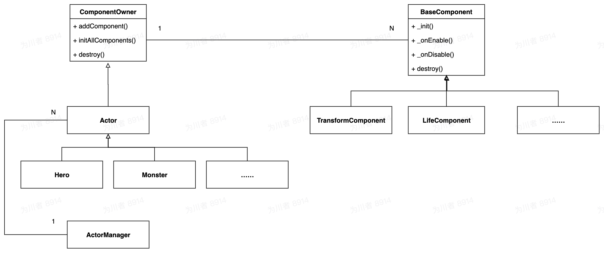

# LuaComponents

**Tips：**

1. 核心是：一个 `ComponentOwner` 组装若干个 `BaseComponent` 子类 

   **（即：用组合而不用继承  [Favour composition over inheritance](https://en.wikipedia.org/wiki/Composition_over_inheritance) ）**

2. 代码详见 luaComponents 文件夹；

3. 各组件之间可以通过事件通讯，相当于一个星状结构，本代码自带事件系统；

4. 示例是从 `ComponentOwner` 派生了一个 `Actor` 的概念，然后再派生出不同类型的，比如，英雄、野怪等，根根据不同类型的`Actor` 而组装不同的  `BaseComponent` 子类，通过 `actor_comp_config.lua` 配置实现；

5. 示例的入口是：`main.lua`

